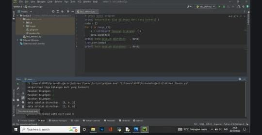
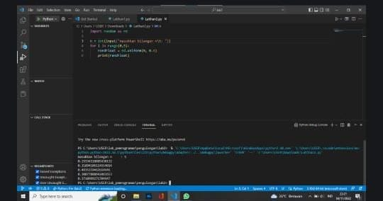

# project1
## lab2 
## latihan1

## latihan 2

## lab3
## latihan1

## latihan2

## labpy02
## latihan1

Input bilangan sebanyak 3 input bilangan.
Setelah bilangan di masukkan, maka program akan membandingkan ke 3 bilangan tersebut.
Perbandingan menggunakan statement if.
Ketika bilangan pertama (A), dibandingkan dengan bilangan ke dua (B), dan bilangan ke tiga (C). Apabila menghasilkan nilai bilangan ke dua, makan akan tercetak nilai yang di input oleh bilangan ke dua.

## labpy03
## latihan1

Penjelasan
print('Masukan nilai N:5')
import random
jumlah=5
a=0
for x in range(jumlah):
i = random.uniform(.0,.5)
a+=1
print('data ke:',a,'==>',i)
print()
"print":Berfungsii untuk mencetak atau menampilkan objek ke perangkat keluaran atau file teks.
"Import":Berfungsi lanjut yang di panggil oleh statement import.
"random":untuk menentukan suatu pilihan.
"range":nerupakan fungsi yang menghasilkan list. Fungsi ini akan menciptakan sebuah list baru dengan rentang nilai tertentu.
"uniform":digunakan untuk menampilkan bilangan float random dengan batas awal bilangan x, dan batas akhir bilangan y.

